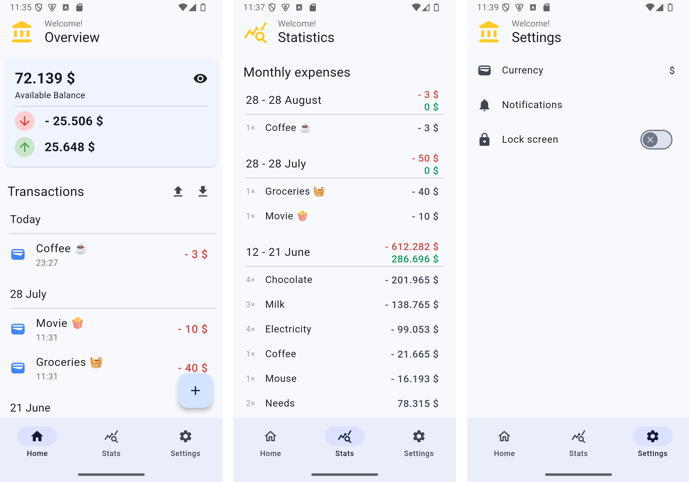

# Wallet app

# What is it?
A mobile app that allows you to follow and extract insights on your transactions.

Features:
- Accepts manual inputs of transactions, whether be it something you bought or sold
- Displays all expenses by day or by month
- Allows to configure reminder notifications
- Syncs data to the cloud by choice
- App lock screen

App is still under active development. Working on this on my free time. 
Feel free to reach out if you would like to request a feature or collaborate.

